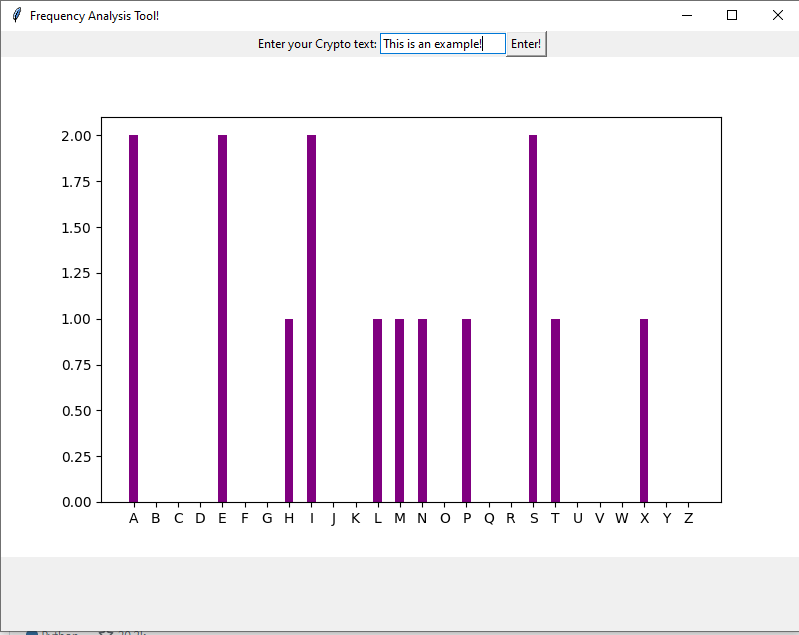

# CryptoAnalysisFun

## This project is intended only for CTFs and educational purposes. 

### To run
```python3 main.py```

Naturally you can run from pycharm or any of your favourite IDE. 

#### Example UI current


### Work in Progress:
This is just an initial prototype. Currently, it just counts the letters (English only for now), 
more functionality will be added. Working at the moment to expand the statistical
tooling to differentiate between stream and block ciphers and so on. If you
have suggestions of functionality, send them my way. 

Thanks.

Happy Hacker.